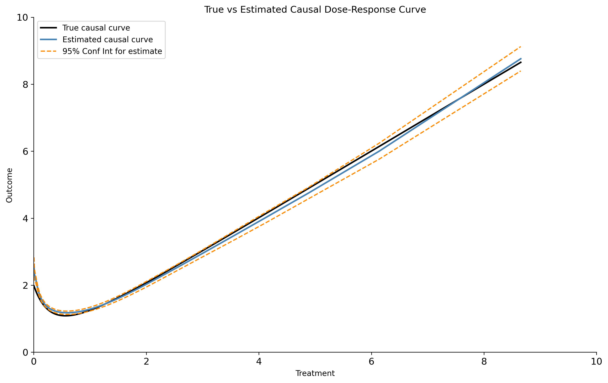

.. _GPS_Classifier:

============================================================
GPS_Classifier Tool (continuous treatments, binary outcomes)
============================================================

Generalized propensity score method
-----------------------------------

In this example, we use this package's GPS tool to estimate the marginal causal curve of some
continuous treatment on a continuous outcome, accounting for some mild confounding effects.
To put this differently, the result of this will be an estimate of the average
of each individual's dose-response to the treatment. To do this we employ the
generalized propensity score (GPS) to correct the treatment prediction of the outcome.

Compared with the package's TMLE method, this GPS method is more computationally efficient,
better suited for large datasets, but produces significantly wider confidence intervals.

In this example we use simulated data originally developed by Hirano and Imbens but adapted by others
(see references). The advantage of this simulated data is it allows us
to compare the estimate we produce against the true, analytically-derived causal curve.

Let :math:`t_i` be the treatment for the i-th unit, let :math:`x_1` and :math:`x_2` be the
confounding covariates, and let :math:`y_i` be the outcome measure. We assume that the covariates
and treatment are exponentially-distributed, and the treatment variable is associated with the
covariates in the following way:

>>> import numpy as np
>>> import pandas as pd
>>> from scipy.stats import expon

>>> np.random.seed(333)
>>> n = 5000
>>> x_1 = expon.rvs(size=n, scale = 1)
>>> x_2 = expon.rvs(size=n, scale = 1)
>>> treatment = expon.rvs(size=n, scale = (1/(x_1 + x_2)))

The GPS is given by

.. math::

   f(t, x_1, x_2) = (x_1 + x_2) * e^{-(x_1 + x_2) * t}

If we generate the outcome variable by summing the treatment and GPS, the true causal
curve is derived analytically to be:

.. math::

   f(t) = t + \frac{2}{(1 + t)^3}

The following code completes the data generation:

>>> gps = ((x_1 + x_2) * np.exp(-(x_1 + x_2) * treatment))
>>> outcome = treatment + gps + np.random.normal(size = n, scale = 1)

>>> truth_func = lambda treatment: (treatment + (2/(1 + treatment)**3))
>>> vfunc = np.vectorize(truth_func)
>>> true_outcome = vfunc(treatment)

>>> df = pd.DataFrame(
>>>     {
>>>         'X_1': x_1,
>>>         'X_2': x_2,
>>>         'Treatment': treatment,
>>>         'GPS': gps,
>>>         'Outcome': outcome,
>>>         'True_outcome': true_outcome
>>>     }
>>> ).sort_values('Treatment', ascending = True)

With this dataframe, we can now calculate the GPS to estimate the causal relationship between
treatment and outcome. Let's use the default settings of the GPS tool:

>>> from causal_curve import GPS
>>> gps = GPS()
>>> gps.fit(T = df['Treatment'], X = df[['X_1', 'X_2']], y = df['Outcome'])
>>> gps_results = gps.calculate_CDRC(0.95)

You now have everything to produce the following plot with matplotlib. In this example with only mild confounding,
the GPS-calculated estimate of the true causal curve produces has approximately
half the error of a simple LOESS estimate using only the treatment and the outcome.

A binary outcome can also be handled with the GPS tool. As long as the outcome series contains
binary integer values (e.g. 0's and 1's) the GPS `fit` method will work as it's supposed to.

The GPS tool also allows you to estimate a specific set of points along the causal curve.
In the case of a continuous outcome, use the `predict` and `predict_interval` methods
to produce a point estimate and prediction interval, respectively. In the case of a
binary outcome, use the `predict_log_odds` methods to calculate the log odds of the
highest outcome class.

References
----------

Galagate, D. Causal Inference with a Continuous Treatment and Outcome: Alternative
Estimators for Parametric Dose-Response function with Applications. PhD thesis, 2016.

Moodie E and Stephens DA. Estimation of dose–response functions for
longitudinal data using the generalised propensity score. In: Statistical Methods in
Medical Research 21(2), 2010, pp.149–166.

Hirano K and Imbens GW. The propensity score with continuous treatments.
In: Gelman A and Meng XL (eds) Applied bayesian modeling and causal inference
from incomplete-data perspectives. Oxford, UK: Wiley, 2004, pp.73–84.
