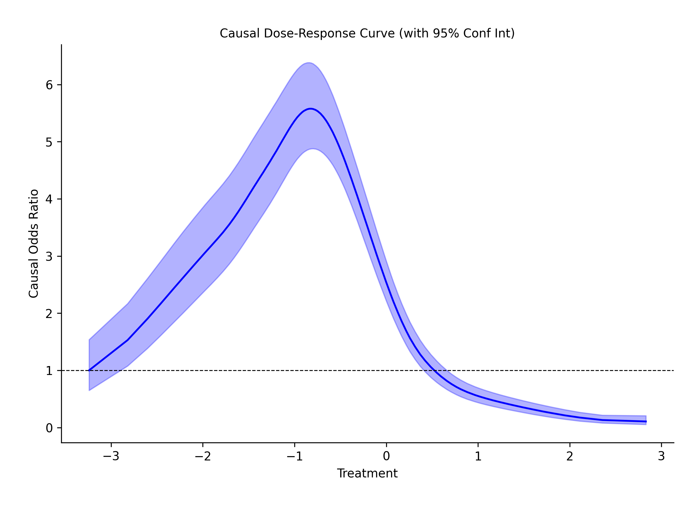

.. _GPS_Classifier:

============================================================
GPS_Classifier Tool (continuous treatments, binary outcomes)
============================================================

As with the other GPS tool, we calculate generalized propensity scores (GPS) but
with the classifier we can estimate the point-by-point causal contribution of
a continuous treatment to a binary outcome. The GPS_Classifier does this by
estimating the log odds of a positive outcome and odds ratio (odds of positive outcome / odds of negative outcome) along
the entire range of treatment values:

Currently, the causal-curve package does not contain a TMLE implementation that is appropriate for a binary outcome,
so the GPS_Classifier tool will have to suffice for this sort of outcome.

This tool works much like the _GPS_Regressor tool; as long as the outcome series in your dataframe contains
binary integer values (e.g. 0's and 1's) the ``fit()`` method will work as it's supposed to:

>>> df.head(5) # a pandas dataframe with your data
           X_1       X_2  Treatment    Outcome
0     0.596685  0.162688   0.000039     1
1     1.014187  0.916101   0.000197     0
2     0.932859  1.328576   0.000223     0
3     1.140052  0.555203   0.000339     0
4     1.613471  0.340886   0.000438     1

With this dataframe, we can now calculate the GPS to estimate the causal relationship between
treatment and outcome. Let's use the default settings of the GPS tool:

>>> from causal_curve import GPS_Classifier
>>> gps = GPS()
>>> gps.fit(T = df['Treatment'], X = df[['X_1', 'X_2']], y = df['Outcome'])
>>> gps_results = gps.calculate_CDRC(0.95)

The ``gps_results`` object (a dataframe) now contains all of the data to produce the above plot.

If you'd like to estimate the log odds at a specific point on the curve, use the
``predict_log_odds`` to do so.

References
----------

Galagate, D. Causal Inference with a Continuous Treatment and Outcome: Alternative
Estimators for Parametric Dose-Response function with Applications. PhD thesis, 2016.

Moodie E and Stephens DA. Estimation of dose–response functions for
longitudinal data using the generalised propensity score. In: Statistical Methods in
Medical Research 21(2), 2010, pp.149–166.

Hirano K and Imbens GW. The propensity score with continuous treatments.
In: Gelman A and Meng XL (eds) Applied bayesian modeling and causal inference
from incomplete-data perspectives. Oxford, UK: Wiley, 2004, pp.73–84.
