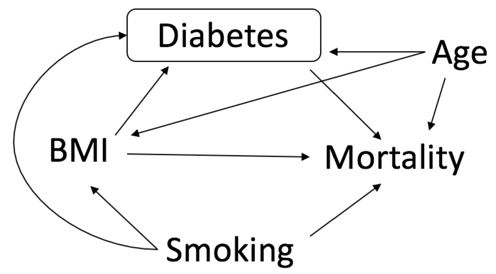
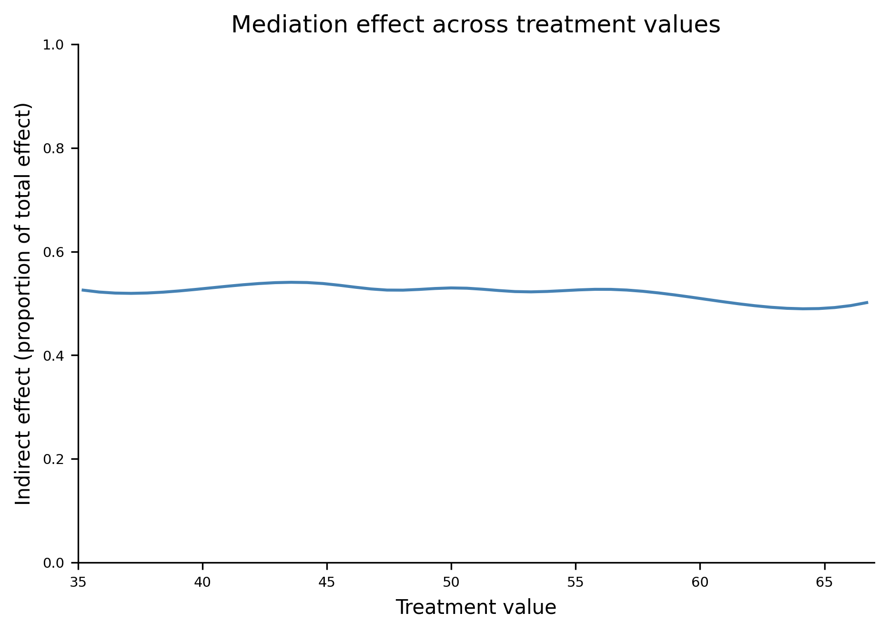

.. _Mediation_example:

==========================================================
Test for Mediation for continuous treatments and mediators
==========================================================

Mediation test
--------------

It trying to explore the causal relationships between various elements, oftentimes you'll use
your domain knowledge to sketch out your initial ideas about the causal connections.
See the following causal DAG of the expected relationships between smoking, diabetes, obesity, age,
and mortality (Havumaki et al.):

At some point though, it's helpful to validate these ideas with empirical tests.
This tool provides a test that can estimate the amount of mediation that occurs between
a treatment, a purported mediator, and an outcome. In keeping with the causal curve theme,
this tool uses a test developed my Imai et al. when handling a continuous treatment and
mediator.

In this example we use the following simulated data, and assume that the `mediator`
variable is decided to be a mediator by expert judgement.

>>> import numpy as np
>>> import pandas as pd

>>> np.random.seed(132)
>>> n_obs = 500

>>> treatment = np.random.normal(loc=50.0, scale=10.0, size=n_obs)
>>> mediator = np.random.normal(loc=70.0 + treatment, scale=8.0, size=n_obs)
>>> outcome = np.random.normal(loc=(treatment + mediator - 50), scale=10.0, size=n_obs)

>>> df = pd.DataFrame(
>>>    {
>>>        "treatment": treatment,
>>>        "mediator": mediator,
>>>        "outcome": outcome
>>>    }
>>> )

Now we can instantiate the Mediation class:

>>> from causal_curve import Mediation
>>> med = Mediation(
>>>        bootstrap_draws=100,
>>>        bootstrap_replicates=100,
>>>        spline_order=3,
>>>        n_splines=5,
>>>        verbose=True,
>>> )

We then fit the data to the `med` object:

>>> med.fit(
>>>     T=df["treatment"],
>>>     M=df["mediator"],
>>>     y=df["outcome"],
>>> )

With the internal models of the mediation test fit with data, we can now run the
`calculate_mediation` method to produce the final report:

>>> med.calculate_mediation(ci = 0.95)
>>>
>>> ----------------------------------
>>> Mean indirect effect proportion: 0.5238 (0.5141 - 0.5344)
>>>
>>> Treatment_Value  Proportion_Direct_Effect  Proportion_Indirect_Effect
>>> 35.1874                    0.4743                      0.5257
>>> 41.6870                    0.4638                      0.5362
>>> 44.6997                    0.4611                      0.5389
>>> 47.5672                    0.4745                      0.5255
>>> 50.1900                    0.4701                      0.5299
>>> 52.7526                    0.4775                      0.5225
>>> 56.0204                    0.4727                      0.5273
>>> 60.5174                    0.4940                      0.5060
>>> 66.7243                    0.4982                      0.5018

The final analysis tells us that overall, the mediator is estimated to account for
around 52% (+/- 1%) of the effect of the treatment on the outcome. This indicates that
moderate mediation is occurring here. The remaining 48% occurs through a direct effect of the
treatment on the outcome.

So long as we are confident that the mediator doesn't play another role in the causal graph
(it isn't a confounder of the treatment and outcome association), this supports the idea that
the mediator is in fact a mediator.

The report also shows how this mediation effect various as a function of the continuous treatment.
In this case, it looks the effect is relatively flat (as expected). With a little processing
and some basic interpolation, we can plot this mediation effect:

References
----------

Imai K., Keele L., Tingley D. A General Approach to Causal Mediation Analysis. Psychological
Methods. 15(4), 2010, pp.309–334.

Havumaki J., Eisenberg M.C. Mathematical modeling of directed acyclic graphs to explore
competing causal mechanisms underlying epidemiological study data. medRxiv preprint.
doi: https://doi.org/10.1101/19007922. Accessed June 23, 2020.
