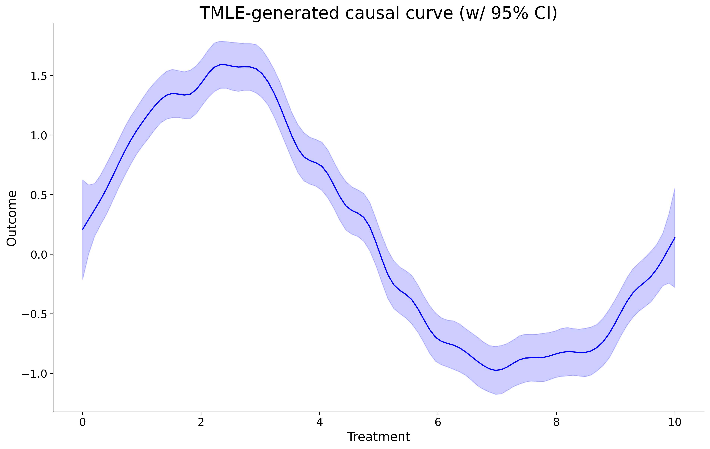

.. _TMLE_Regressor:

================================================================
TMLE_Regressor Tool (continuous treatments, continuous outcomes)
================================================================

In this example, we use this package's Targeted Maximum Likelihood Estimation (TMLE)
tool to estimate the marginal causal curve of some continuous treatment on a continuous outcome,
accounting for some mild confounding effects.

The TMLE algorithm is doubly robust, meaning that as long as one of the two models contained
with the tool (the ``g`` or ``q`` models) performs well, then the overall tool will correctly
estimate the causal curve.

Compared with the package's GPS methods incorporates more powerful machine learning techniques internally (gradient boosting)
and produces significantly smaller confidence intervals. However it is less computationally efficient
and will take longer to run. In addition, **the treatment values provided should
be roughly normally-distributed**, otherwise you may encounter internal math errors.

Let's first generate some simple toy data:

>>> import matplotlib.pyplot as plt
import numpy as np
import pandas as pd
from causal_curve import TMLE_Regressor
np.random.seed(200)

>>> def generate_data(t, A, sigma, omega, noise=0, n_outliers=0, random_state=0):
	y = A * np.exp(-sigma * t) * np.sin(omega * t)
	rnd = np.random.RandomState(random_state)
	error = noise * rnd.randn(t.size)
	outliers = rnd.randint(0, t.size, n_outliers)
	error[outliers] *= 35
	return y + error

>>> treatment = np.linspace(0, 10, 1000)
outcome = generate_data(
	t = treatment,
	A = 2,
	sigma = 0.1,
	omega = (0.1 * 2 * np.pi),
	noise = 0.1,
	n_outliers = 5
)
x1 = np.random.uniform(0,10,1000)
x2 = (np.random.uniform(0,10,1000) * 3)

>>> df = pd.DataFrame(
	{
		'x1': x1,
		'x2': x2,
		'treatment': treatment,
		'outcome': outcome
	}
)

All we do now is employ the TMLE_Regressor class, with mostly default settings:

>>> from causal_curve import TMLE_Regressor
tmle = TMLE_Regressor(
    random_seed=111
)

>>> tmle.fit(T = df['Treatment'], X = df[['X_1', 'X_2']], y = df['Outcome'])
gps_results = tmle.calculate_CDRC(0.99)

The resulting dataframe contains all of the data you need to generate the following plot:

To generate user-specified points along the curve, use the ``point_estimate`` and ``point_estimate_interval`` methods:

>>> tmle.point_estimate(np.array([5.5]))
tmle.point_estimate_interval(np.array([5.5]))

References
----------

Kennedy EH, Ma Z, McHugh MD, Small DS. Nonparametric methods for doubly robust estimation
of continuous treatment effects. Journal of the Royal Statistical Society, Series B. 79(4), 2017, pp.1229-1245.

van der Laan MJ and Rubin D. Targeted maximum likelihood learning. In: ​U.C. Berkeley Division of
Biostatistics Working Paper Series, 2006.

van der Laan MJ and Gruber S. Collaborative double robust penalized targeted
maximum likelihood estimation. In: The International Journal of Biostatistics 6(1), 2010.
