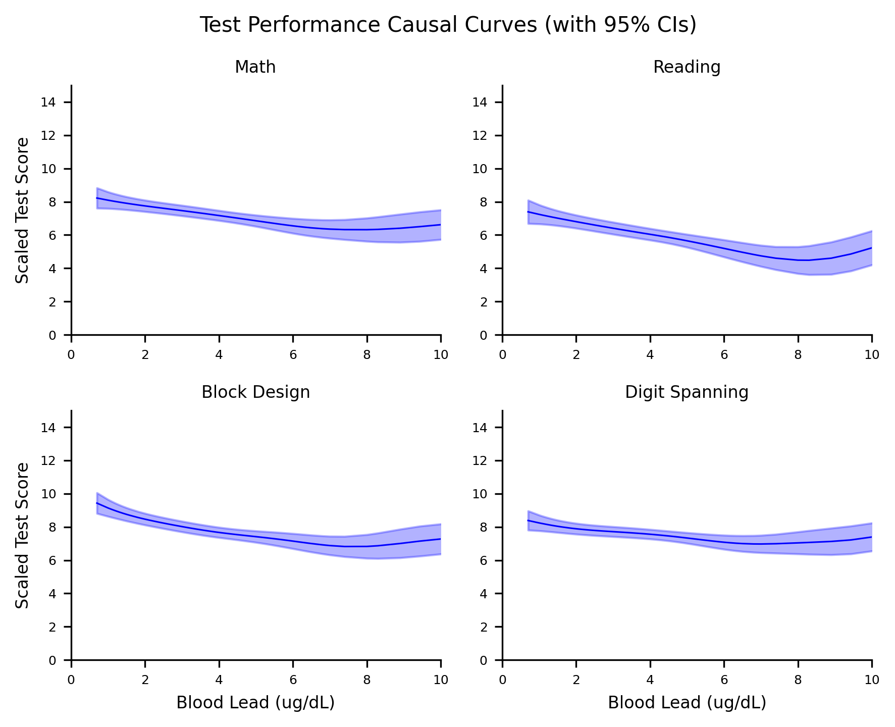

.. _full_example:

=============================================================
Health data: generating causal curves and examining mediation
=============================================================

The causal effect of blood lead levels on cognitive performance in children
---------------------------------------------------------------------------

To provide an end-to-end example of the sorts of analyses `cause-curve` can be used for, we'll
begin with an epidemiology topic. A notebook containing the pipeline to produce the following
output `is available here <https://github.com/ronikobrosly/causal-curve/blob/master/examples/NHANES_BLL_example.ipynb>`_.
Note: Specific examples of the individual `causal-curve` tools with
code are available elsewhere in this documentation.

Despite the banning of the use of lead-based paint and the use of lead in gasoline in the United
States, lead exposure remains an enormous public health problem for children and adolescents. This
is particularly true for poorer children living in older homes in inner-city environments.
For children, there is no known safe level of exposure to lead, and even small levels of
lead measured in their blood have been shown to affect IQ and academic achievement.
One of the scariest parts of lead exposure is that its effects are permanent. Blood lead levels (BLLs)
of 5 ug/dL or higher are considered elevated.

There are much research around and many government programs for lead abatement. In terms of
public policy, it would be helpful to understand how childhood cognitive outcomes would be affected by
reducing BLLs in children. This is the causal question to answer, with blood lead
levels being the continuous treatment, and the cognitive outcomes being the outcome of interest.

.. image:: https://upload.wikimedia.org/wikipedia/commons/6/69/LeadPaint1.JPG

(Photo attribution: Thester11 / CC BY (https://creativecommons.org/licenses/by/3.0))

To explore that problem, we can analyze data collected from the National Health and Nutrition
Examination Survey (NHANES) III. This was a large, national study of families throughout the United
States, carried out between 1988 and 1994. Participants were involved in extensive interviews,
medical examinations, and provided biological samples. As part of this project, BLLs
were measured, and four scaled sub-tests of the Wechsler Intelligence Scale for Children-Revised
and the Wide Range Achievement Test-Revised (WISC/WRAT) cognitive test were carried out. This data
is de-identified and publicly available on the Centers for Disease Control and Prevention (CDC)
government website.

When processing the data and missing values were dropped, there were 1,764 children between
6 and 12 years of age with complete data. BLLs among these children were log-normally
distributed, as one would expect:

The four scaled sub-tests of the WISC/WRAT included a math test, a reading test, a block design
test (a test of spatial visualization ability and motor skill), and a digit spanning test
(a test of memory). Their distributions are shown here:

Using a well-known study by Bruce Lanphear conducted in 2000 as a guide, we used the following
features as potentially confounding "nuisance" variables:

- Child age
- Child sex (in 1988 - 1994 the CDC assumed binary sex)
- Child race/ethnicity
- The education level of the guardian
- Whether someone smokes in the child's home
- Whether the child spent time in a neonatal intensive care unit as a baby
- Whether the child is experiencing food insecurity (is food sometimes not available due to lack of resources?).

In our simulated "experiment", these above confounders will be controlled for.

By using either the GPS or TMLE tools included in `causal-curve` one can generate the causal
dose-response curves for BLLs in relation to the four outcomes:

Note that the lower limit of detection for the blood lead test in this version of NHANES was
0.7 ug/dL. So lead levels below that value are not possible.

In the case of the math test, these results indicate that by reducing BLLs in this population
to their lowest value would cause scaled math scores to increase by around 2 points, relative
to the BLLs around 10 ug/dL. Similar results are found for the reading and block design test,
although the digit spanning test causal curve appears possibly flat (although with the sparse
observations at the higher end of the BLL range and the wide confidence intervals it is
difficult to say).

The above curves differ from standard regression curves in a few big ways:

- Even though the data that we used to generate these curves are observational, if causal inference assumptions are met, these curves can be interpretted as causal.
- These models were created using the potential outcomes / counterfactual framework, while standard models are not. Also, the approach we used here essentially simulates experimental conditions by balancing out treatment assignment across the various confounders, and controlling for their effects.
- Even if complex interactions between the variables are modelled, these curves average over the various interaction effects and subgroups. In this sense, these are "marginal" curves.
- These curves should not be used to make predictions at the individual level. These are population level estimates and should remain that way.

Do blood lead levels mediate the relationship between poverty and cognitive performance?
----------------------------------------------------------------------------------------

There is a well-known link between household income and child academic performance. Now that we
have some evidence of a potentially causal relationship between BLLs and test performance in
children, one might wonder if lead exposure might mediate the relationship between household income
academic performance. In other words, in this population does low income cause one to be
exposed more to lead, which in turn causes lower performance? Or is household income directly
linked with academic performance or through other variables?

NHANES III captured each household's Poverty Index Ratio (the ratio of total family income to
the federal poverty level for the year of the interview). For this example, let's focus just
on the math test as an outcome. Using `causal-curve`'s mediation tool,
we found that the overall, mediating indirect effect of BLLs are 0.20 (0.17 - 0.23). This means
that lead exposure accounts for 20% of the relationship between low income and low test
performance in this population. The mediation tool also allows you to see how the indirect effect
varies as a function of the treatment. As the plot shows, the mediating effect is relatively flat,
although interesting there is a hint of an increase as income increases relative to the povetry line.

References
----------

Centers for Disease Control and Prevention. NHANES III (1988-1994).
https://wwwn.cdc.gov/nchs/nhanes/nhanes3/default.aspx. Accessed on July 2, 2020.

Centers for Disease Control and Prevention. Blood Lead Levels in Children.
https://www.cdc.gov/nceh/lead/prevention/blood-lead-levels.htm. Accessed on July 2, 2020.

Environmental Protection Agency. Learn about Lead. https://www.epa.gov/lead/learn-about-lead.
Accessed on July 2, 2020.

Pirkle JL, Kaufmann RB, Brody DJ, Hickman T, Gunter EW, Paschal DC. Exposure of the
U.S. population to lead, 1991-1994. Environmental Health Perspectives, 106(11), 1998, pp. 745–750.

Lanphear BP, Dietrich K, Auinger P, Cox C. Cognitive Deficits Associated with
Blood Lead Concentrations <10 pg/dL in US Children and Adolescents.
In: Public Health Reports, 115, 2000, pp.521-529.
