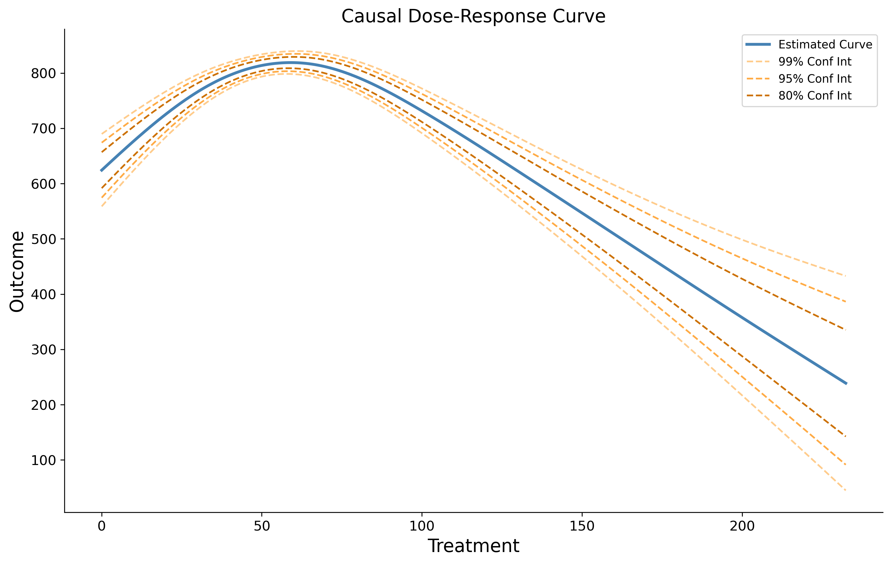
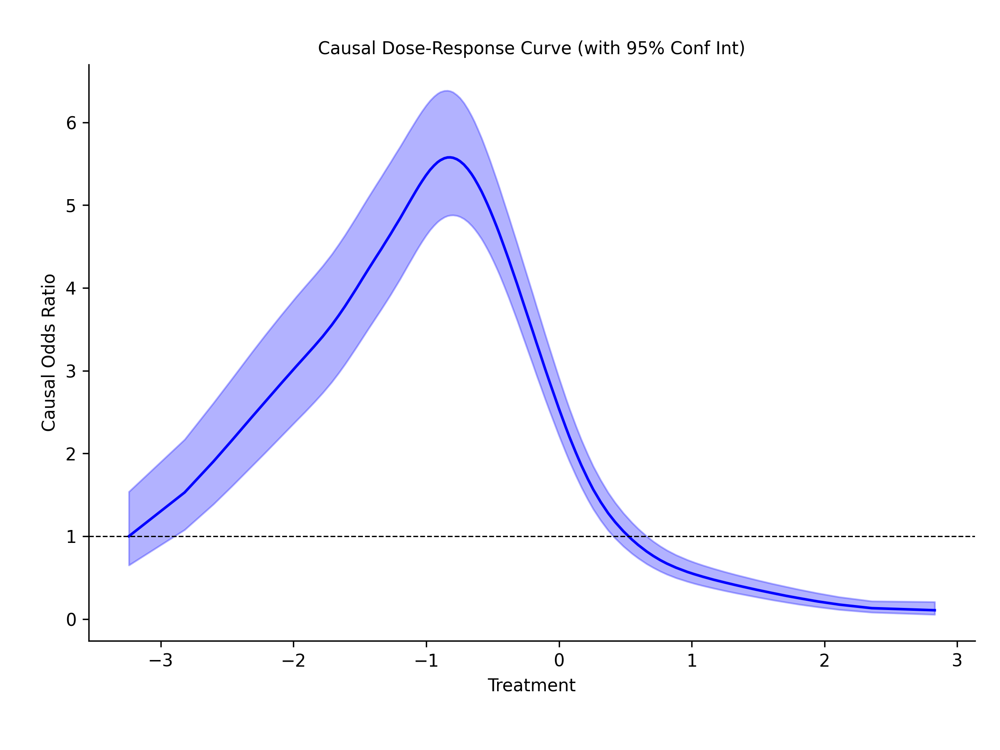

.. _intro:

============================
Introduction to causal-curve
============================

In academia and industry, randomized controlled experiments (or simply experiments or "A/B tests") are considered the gold standard approach for assessing the true, causal impact
of a treatment or intervention. For example:

* We want to increase the number of times per day new customers log into our business's website. Will it help if we send daily emails out to our customers? We take a group of 2000 new business customers and half is randomly chosen to receive daily emails while the other half receives one email per week. We follow both groups forward in time for a month compare each group's average number of logins per day.

However, for ethical or financial reasons, experiments may not always be feasible to carry out.

* It's not ethical to randomly assign some people to receive a possible carcinogen in pill form while others receive a sugar pill, and then see which group is more likely to develop cancer.
* It's not feasible to increase the household incomes of some New York neighborhoods, while leaving others unchanged to see if changing a neighborhood's income inequality would improve the local crime rate.

"Causal inference" methods are a set of approaches that attempt to estimate causal effects
from observational rather than experimental data, correcting for the biases that are inherent
to analyzing observational data (e.g. confounding and selection bias) [@Hernán:2020].

As long as you have varying observational data on some treatment, your outcome of interest,
and potentially confounding variables across your units of analysis (in addition to meeting the assumptions described below),
then you can essentially estimate the results of a proper experiment and make causal claims.

Interpreting the causal curve
------------------------------

Two of the methods contained within this package produce causal curves for continuous treatments
(see the GPS and TMLE methods). Both continuous and binary treatments can be modeled
(only the `GPS_Classifier` tool can handle binary outcomes).

**Continuous outcome:**

Using the above causal curve as an example, we see that employing a treatment value between 50 - 60
causally produces the highest outcome values. We also see that
the treatment produces a smaller effect if lower or higher than that range. The confidence
intervals become wider on the parts of the curve where we have fewer data points (near the minimum and
maximum treatment values).

This curve differs from a simple bivariate plot of the treatment and outcome or even a similar-looking plot
generated through standard multivariable regression modeling in a few important ways:

* This curve represents the estimated causal effect of a treatment on an outcome, not the association between treatment and outcome.
* This curve represents a population-level effect, and should not be used to infer effects at the individual-level (or whatever the unit of analysis is).
* To generate a similar-looking plot using multivariable regression, you would have to hold covariates constant, and any treatment effect that is inferred occurs within the levels of the covariates specified in the model. The causal curve averages out across all of these strata and gives us the population marginal effect.

**Binary outcome:**

In the case of binary outcome, the `GPS_Classifier` tool can be used to estimate a curve of odds ratios. Every
point on the curve is relative to the lowest treatment value. The highest effect (relative to the lowest treatment value)
is around a treatment value of -1.2. At this point in the treatment, the odds of a positive class
occurring is 5.6 times higher compared with the lowest treatment value. This curve is always on
the relative scale. This is why the odds ratio for the lowest point is always 1.0, because it is
relative to itself. Odds ratios are bounded [0, inf] and cannot take on a negative value. Note that
the confidence intervals at any given point in the curve isn't symmetric.

A caution about causal inference assumptions
--------------------------------------------

There is a well-documented set of assumptions one must make to infer causal effects from
observational data. These are covered elsewhere in more detail, but briefly:

- Causes always occur before effects: The treatment variable needs to have occurred before the outcome.
- SUTVA: The treatment status of a given individual does not affect the potential outcomes of any other individuals.
- Positivity: Any individual has a positive probability of receiving all values of the treatment variable.
- Ignorability: All major confounding variables are included in the data you provide.

Violations of these assumptions will lead to biased results and incorrect conclusions!

In addition, any covariates that are included in `causal-curve` models are assumed to only
be **confounding** variables.

None of the methods provided in causal-curve rely on inference via instrumental variables, they only
rely on the data from the observed treatment, confounders, and the outcome of interest (like the above GPS example).

References
----------

Hernán M. and Robins J. Causal Inference: What If. Chapman & Hall, 2020.

Ahern J, Hubbard A, and Galea S. Estimating the Effects of Potential Public Health Interventions
on Population Disease Burden: A Step-by-Step Illustration of Causal Inference Methods. American Journal of Epidemiology.
169(9), 2009. pp.1140–1147.
