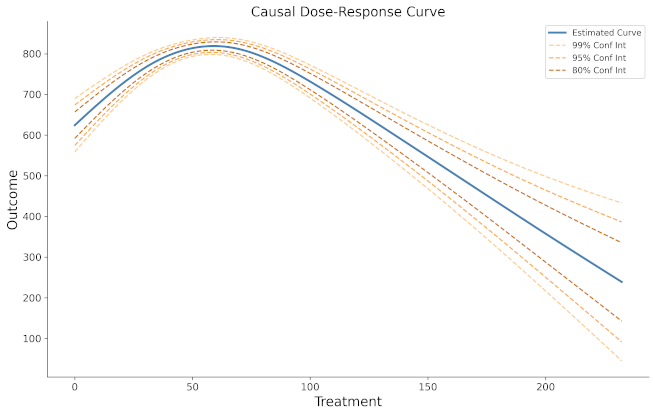

# Summary

In academia and industry, randomized controlled experiments (colloquially "A/B tests")
are considered the gold standard approach for assessing the impact of a treatment or intervention.
However, for ethical or financial reasons, these experiments may not always be feasible to carry out.
"Causal inference" methods are a set of approaches that attempt to estimate causal effects
from observational rather than experimental data, correcting for the biases that are inherent
to analyzing observational data (e.g. confounding and selection bias) [@Hernán:2020].

Although much significant research and implementation effort has gone towards methods in
causal inference to estimate the effects of binary treatments (e.g. did the population receive
treatment "A" or "B"), much less has gone towards estimating the effects of continuous treatments.
This is unfortunate because there are there are a large number of use cases in research
and industry that could benefit from tools to estimate the effect of
continuous treatments, such as estimating how:

- the number of minutes per week of aerobic exercise causes positive health outcomes,
after controlling for confounding effects.
- increasing or decreasing the price of a product would impact demand (price elasticity).
- changing neighborhood income inequality (as measured by the continuous Gini index)
might or might not be causally related to the neighborhood crime rate.
- blood lead levels are causally related to neurodevelopment delays in children.

`causal-curve` is a Python package created to address this gap; it is designed to perform
causal inference when the treatment of interest is continuous in nature.
From the observational data that is provided by the user, it estimates the
"causal dose-response curve" (or simply the "causal curve").

In the current release of the package there are two unique model classes for
constructing the causal dose-response curve: the Generalized Propensity Score (GPS) and the
Targetted Maximum Likelihood Estimation (TMLE) tools. There is also tool
to assess causal mediation effects in the presence of a continuous mediator and treatment.

`causal-curve` attempts to make the user-experience as painless as possible:

- This package's API was designed to resemble that of `scikit-learn`, as this is a commonly
used Python predictive modeling framework that most machine learning practioners are familiar with.
- All of the major classes contained in `causal-curve` readily use Pandas DataFrames and Series as
inputs, to make this package more easily integrate with the standard Python data analysis tools.
- A full, end-to-end example of applying the package to a causal inference problem (the analysis of health data)
is provided. In addition to this, there are shorter tutorials for each of the three major classes are available online in the documentation, along with full documentation of all of their parameters, methods, and attributes.

This package includes a suite of unit and integration tests made using the pytest framework. The
repo containing the latest project code is integrated with TravisCI for continuous integration. Code
coverage is monitored via codecov and is presently above 90%.

# Methods

The `GPS` method was originally described by Hirano [@Hirano:2004],
and expanded by Moodie [@Moodie:2010] and more recently by Galagate [@Galagate:2016]. GPS is
an extension of the standard propensity tool method. It is the treatment assignment density calculated
at a particular treatment (and covariate) value. Similar to the standard propensity score approach,
the GPS random variable is used to balance covariates. Compared with the package’s TMLE method,
this GPS method is more computationally efficient, better suited for large datasets,
but produces significantly wider confidence intervals.

The `TMLE` method is based on van der Laan's work on an approach to causal inference that would
employ powerful machine learning approaches to estimate a causal effect [@van_der_Laan:2010] [@van_der_Laan:2006].
TMLE involves, predicting the outcome from the treatment and covariates using a machine learning model,
then predicting treatment assignment from the covariates, and employs a substitution “targeting”
step correct for covariate imbalance and to estimate an unbiased causal effect.
Currently, there is no implementation of TMLE that is suitable for continuous treatments, so the
implemention in `causal-curve` constructs as series of binary treatment comparisons across the
user-specified range of treatment values, and then connects these binary estimates to construct
the final causal curve. Compared with the package’s GPS method, this TMLE method is double robust
against model misspecification, incorporates more powerful machine learning techniques internally, produces significantly
smaller confidence intervals, however it is less computationally efficient.

`causal-curve` allows for continuous mediation assessment with the `Mediation` tool. As described
by Imai this approach [@Imai:2010].

# Statement of Need

While there are a few established Python packages related to causal inference, to the best of
the author's knowledge, there is no Python package available that can provide support for
continuous treatments as `causal-curve` does. Similarly, the author isn't aware of any Python
implementation of a causal mediation analysis for continuous treatments and mediators. Finally,
the tutorials available in the documentation introduce the concept of continuous treatments
and are instructive as to how the results of their analysis should be interpretted.

# Acknowledgements

We acknowledge contributions from Miguel-Angel Luque, Erica Moodie, and Mark van der Laan
during the creation of this project.

# References
